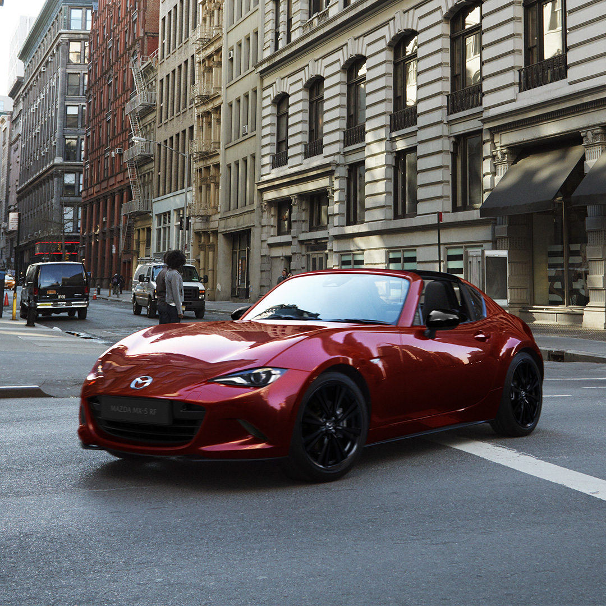
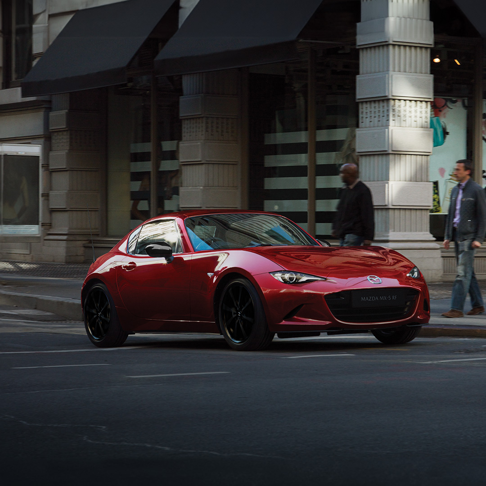
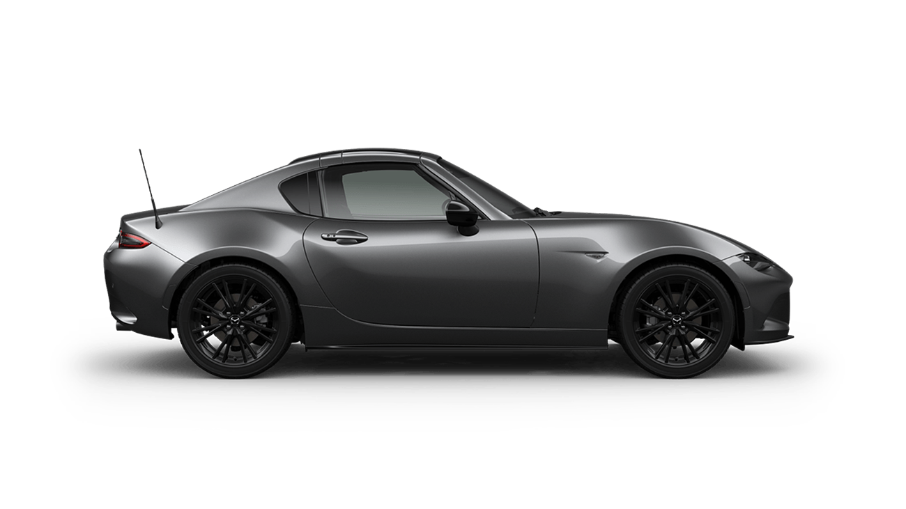

<html lang="zh">
<head>
  <meta charset="UTF-8">
  <meta name="viewport" content="width=device-width, initial-scale=1.0">
  <title>MX-5 Lemon & Juice Progress</title>
  <link href="https://fonts.googleapis.com/css2?family=Roboto:wght@400;700&display=swap" rel="stylesheet">
  
</head>
<body>
  <header>
    <h1>MX-5 Lemon & Juice Progress</h1>
    
目标: 购买 MX-5 (150,000 MYR)

  </header>

  <main>
    

      <h2>销售进度</h2>
      

        
0%

      

      

      

    

    <h2>看看我们的 MX-5</h2>
    
    
    
  </main>

  <footer>
    &copy; 2025 Lemon & Juice MX-5 Progress
  </footer>

  
</body>
</html>
