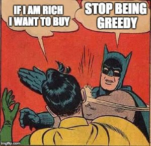

<html lang="zh">
<head>
  <meta charset="UTF-8">
  <meta name="viewport" content="width=device-width, initial-scale=1.0">
  <title>MX-5 Lemon & Juice Progress</title>
  <link href="https://fonts.googleapis.com/css2?family=Roboto:wght@400;700&display=swap" rel="stylesheet">
  
</head>
<body>
  <!-- Hero section with transparent MX-5 background -->
  

    

      <h1>MX-5 Lemon & Juice Progress</h1>
      
目标: 购买 MX-5 (150,000 MYR)

    

  

  <main>
    <!-- Progress bar -->
    

      
0%

    

    

    

    

    <!-- 助力按钮 -->
    

      
      
0

    

    <!-- 两张 MX-5 图片 -->
    

      
      
    

  </main>

  <footer>
    &copy; 2025 Lemon & Juice MX-5 Progress
  </footer>

  
</body>
</html>
