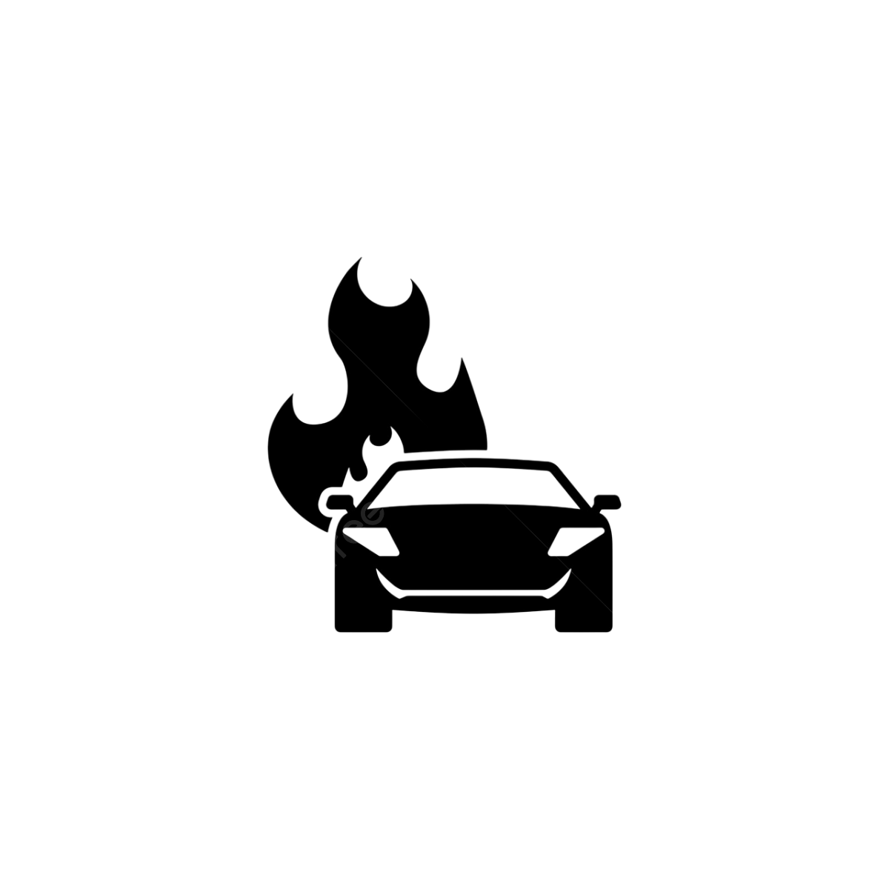

<html lang="zh">
<head>
  <meta charset="UTF-8">
  <meta name="viewport" content="width=device-width, initial-scale=1.0">
  <title>Project Possible</title>
  <link href="https://fonts.googleapis.com/css2?family=Roboto:wght@400;700&display=swap" rel="stylesheet">
  
</head>
<body>
<!-- 左上角购买按钮 -->

  

  <!-- Hero section with new background -->
  

    

      <h1>Project Possible</h1>
      
Goal: Buy a Mazda MX-5 (150,000 MYR)

    

  

  <main>
    <!-- Progress bar -->
    

      
0%

    

    

    

    

    <!-- 助力按钮 -->
    

      
 <button id="supportBtn">👍 Support</button>
    
Support Count: 0

    

    <!-- 两张 MX-5 图片 -->
    

      
      
    

  </main>

  <footer>
    &copy; 2025 Project Possible
    

      每一杯MoyKay出品皆是真诚之作， 
      希望能开启每个消费者一天好心情。 
      好吧骗你们的，我只想买mazda mx5!!!
    

  </footer>

 
